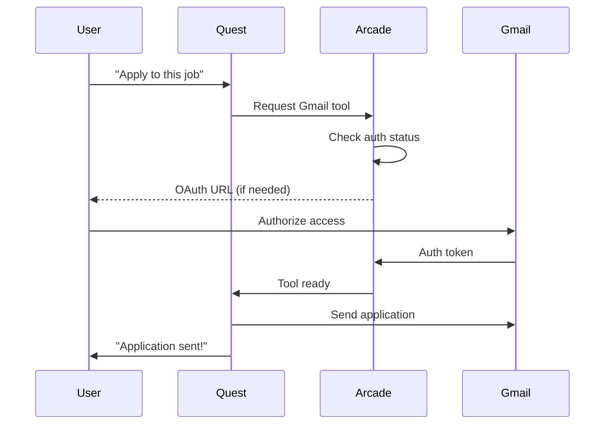

# Arcade.dev Integration Analysis for Quest Core

*Last Updated: December 2024*

## Executive Summary

Arcade.dev represents a paradigm shift for Quest Core, transforming it from a passive career planning tool to an active career development engine. By enabling AI agents to take authenticated actions on behalf of users, Arcade solves the critical "authentication wall" that prevents most AI demos from becoming production-ready applications.

**Key Insight from Cole Medin**: "Most AI agents are demos that work for one user - you. But what happens when you need to scale to thousands or millions of users, and the agent needs personalized memory and tools for every user?"

## What is Arcade.dev?

Arcade.dev is an AI tool-calling platform that provides:

1. **Secure Authentication Layer**: OAuth 2.0, API keys, and custom auth support
2. **Pre-built Integrations**: 30+ services including Gmail, LinkedIn, GitHub, Slack
3. **Runtime Environment**: Safe execution of tools with user-specific permissions
4. **Developer-Friendly**: SDKs for multiple languages, framework integrations
5. **Production-Ready**: Built for scale with enterprise features

## The Authentication Problem It Solves

### Traditional Approach (Doesn't Scale)
```javascript
// Hardcoded credentials - only works for one user
const gmail = new Gmail({
  credentials: MY_GMAIL_CREDENTIALS
})
```

### Arcade Approach (Scales to Millions)
```javascript
// Dynamic user authentication
const gmail = await arcade.requestTool('gmail', userId)
// Arcade handles OAuth flow, token storage, refresh
```

## Pre-Built Integrations Relevant to Quest

### Immediate Value (Available Now)
- **Gmail**: Job applications, outreach, follow-ups
- **Google Calendar**: Interview scheduling, time blocking
- **Google Docs**: Resume management, portfolio
- **LinkedIn**: Profile optimization, networking
- **GitHub**: Code portfolio, project creation
- **Slack**: Team collaboration insights
- **Notion**: Knowledge management, goal tracking
- **Asana**: Project management for career goals

### Future Integrations (Coming Soon)
- **Microsoft Teams**: Corporate collaboration
- **Jira**: Technical project tracking
- **Salesforce**: CRM for placement agents
- **HubSpot**: Marketing automation

## How It Works

### 1. Tool Declaration
```typescript
@arcade.tool({
  name: "send_job_application",
  description: "Send a job application via Gmail",
  auth: { type: "oauth", service: "gmail" }
})
async function sendJobApplication(params: JobApplicationParams) {
  // Arcade automatically injects authenticated Gmail client
  const gmail = arcade.context.gmail
  await gmail.send(params)
}
```

### 2. Just-In-Time Authorization
When a user first needs Gmail access:
1. Agent requests Gmail tool
2. Arcade generates OAuth URL
3. User authorizes specific scopes
4. Tokens stored securely
5. Future requests use cached auth

### 3. LangGraph Integration
```python
# Arcade integrates seamlessly with LangGraph workflows
workflow = StateGraph(AgentState)
workflow.add_node("agent", agent_node)
workflow.add_node("tools", tool_node)
workflow.add_node("authorization", arcade_auth_node)  # Arcade handles this
```

## Quest Core Use Cases

### 1. Automated Job Hunt Assistant

**The Trinity-Aligned Job Search**
```typescript
const jobHuntWorkflow = {
  // Analyze job postings for Trinity alignment
  async analyzeJobs(listings) {
    return listings.filter(job => {
      const alignment = calculateTrinityAlignment(job, userProfile)
      return alignment > 0.8
    })
  },
  
  // Auto-apply to aligned positions
  async applyToJob(job, user) {
    const coverLetter = await generateTrinityAlignedCover(job, user)
    const gmail = await arcade.requestTool('gmail', user.id)
    
    await gmail.sendEmail({
      to: job.applicationEmail,
      subject: `${user.name} - ${job.title} Application`,
      body: coverLetter,
      attachments: [user.resume]
    })
    
    // Schedule follow-up
    await scheduleFollowUp(job, user, '1 week')
  }
}
```

### 2. Professional Network Builder

**LinkedIn Relationship Intelligence**
```typescript
const networkingWorkflow = {
  // Map connections to Neo4j
  async mapProfessionalNetwork(userId) {
    const linkedin = await arcade.requestTool('linkedin', userId)
    const connections = await linkedin.getConnections()
    
    // Store in Neo4j for relationship analysis
    await neo4j.createNetworkGraph(connections)
  },
  
  // Automated outreach
  async reachOutToConnection(targetProfile, user) {
    const message = await generatePersonalizedOutreach(targetProfile, user)
    await linkedin.sendMessage(targetProfile.id, message)
  }
}
```

### 3. Learning Automation

**Skill Development Engine**
```typescript
const learningWorkflow = {
  // Book learning time
  async scheduleSkillDevelopment(skill, user) {
    const calendar = await arcade.requestTool('google_calendar', user.id)
    const github = await arcade.requestTool('github', user.id)
    
    // Create learning blocks
    await calendar.createEvent({
      title: `Learn ${skill}`,
      duration: '2 hours',
      recurring: 'weekly'
    })
    
    // Create practice project
    await github.createRepo({
      name: `${skill}-practice`,
      description: `Learning ${skill} as part of my Quest`
    })
  }
}
```

## Integration Across Quest Ecosystem

### Quest Core (Professional Identity)
- **Discovery**: Access real work artifacts (GitHub, Google Docs)
- **Coaching**: Take action on coach recommendations
- **Tracking**: Monitor actual progress vs. goals

### Placement Agents Platform
- **CRM Integration**: Auto-add leads to HubSpot/Salesforce
- **Email Campaigns**: Personalized outreach at scale
- **Document Sharing**: Secure pitch deck distribution

### Quest PR Platform
- **Media Outreach**: Automated journalist pitching
- **Social Amplification**: Cross-post to all platforms
- **Coverage Tracking**: Monitor and share wins

## Technical Architecture

### Integration Points
```typescript
// 1. Add to package.json
"dependencies": {
  "@arcade-ai/sdk": "^1.0.0",
  "@arcade-ai/langchain": "^1.0.0"
}

// 2. Environment variables
ARCADE_API_KEY=your_api_key
ARCADE_USER_ID_FIELD=clerk_user_id

// 3. Initialize in app
import { ArcadeClient } from '@arcade-ai/sdk'
const arcade = new ArcadeClient({
  apiKey: process.env.ARCADE_API_KEY
})

// 4. Create tool manager
const toolManager = arcade.createToolManager()
const tools = await toolManager.getTools(['gmail', 'linkedin', 'calendar'])
```

### Authentication Flow


## Cost-Benefit Analysis

### Pricing Tiers
- **Free**: 10 MAU, 1,000 calls (Perfect for MVP)
- **Starter**: $50/mo - 200 MAU, 20,000 calls
- **Growth**: $200/mo - 800 MAU, 100,000 calls
- **Enterprise**: Custom pricing, unlimited scale

### ROI Calculation
```
Average time saved per job application: 30 minutes
Applications per user per month: 20
Time saved: 10 hours/month
Value at $50/hour: $500/user/month

Arcade cost per user: $0.25 (Starter tier)
ROI: 2000x
```

## Implementation Roadmap

### Week 1: Foundation
- [ ] Set up Arcade SDK
- [ ] Create authentication flows
- [ ] Build first Gmail workflow
- [ ] Test with 5 beta users

### Week 2: Core Workflows
- [ ] Job application automation
- [ ] LinkedIn networking
- [ ] Calendar scheduling
- [ ] Follow-up sequences

### Week 3: Advanced Features
- [ ] Multi-agent orchestration
- [ ] Cross-platform workflows
- [ ] Analytics dashboard
- [ ] User permission management

### Week 4: Scale
- [ ] Performance optimization
- [ ] Error handling
- [ ] User onboarding
- [ ] Launch to all users

## Security & Privacy Considerations

### User Control
- Granular permission scopes
- Revocation dashboard
- Activity logs
- Data retention policies

### Best Practices
- Request minimal scopes
- Clear value proposition before auth
- Transparent about actions taken
- Regular security audits

## Competitive Advantages

### Why Arcade Over Building In-House

1. **Time to Market**: Months vs. years
2. **Security**: Enterprise-grade vs. risky DIY
3. **Maintenance**: Managed vs. constant updates
4. **Compliance**: Built-in vs. figure it out
5. **Scale**: Proven vs. hope it works

### Market Differentiation

No other career platform offers:
- AI that can apply to jobs for you
- Automated professional networking
- Integrated learning execution
- Cross-platform orchestration

## Success Metrics

### User Engagement
- Authorization rate: >80%
- Actions per user: 50+/month
- Retention: 90% monthly

### Business Impact
- User growth: 10x
- Revenue per user: 3x
- Support tickets: -50%
- Word of mouth: 5x

## Risks & Mitigation

### Technical Risks
- **API Rate Limits**: Implement queuing
- **Service Downtime**: Graceful degradation
- **Token Expiration**: Proactive refresh

### User Risks
- **Over-automation**: Keep human in loop
- **Spam Concerns**: Smart rate limiting
- **Privacy Fears**: Clear communication

## Conclusion

Arcade.dev transforms Quest Core from a career planning tool to a career acceleration platform. By solving the authentication problem elegantly, it enables:

1. **10x User Value**: From insights to action
2. **100x Scale Potential**: Individual to millions
3. **1000x Differentiation**: Unique in market

The integration of Arcade.dev isn't just an enhancement - it's the key to making Quest Core the definitive platform for AI-powered professional development.

---

*"From finding your purpose to achieving it - Quest Core with Arcade.dev makes your professional journey autonomous."*