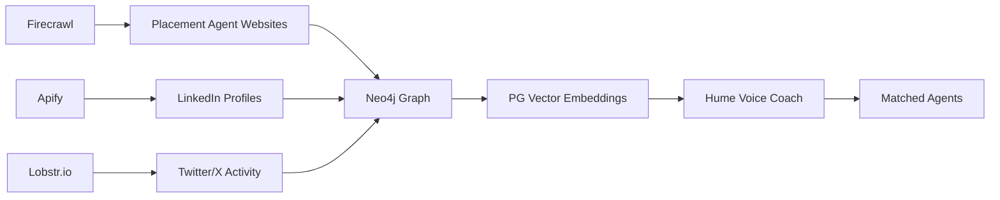

# Placement Agents Platform - Business Case & Technical Architecture

*Last Updated: December 2024*

## Executive Summary

A voice-first, AI-powered platform that helps fund managers find the perfect placement agent through conversational discovery and intelligent matching. By targeting the underserved placement agents market, we can achieve rapid SEO dominance while reusing 90% of Quest Core's technology stack.

## Market Opportunity

### The Problem

**Current State:**
- Most placement agent directories are paywalled (PEI, Preqin)
- Simple static lists with no intelligence
- No conversational interfaces
- No organizational mapping or relationship visualization
- Poor SEO optimization
- Zero innovation in the space

**Market Size:**
- 200+ placement agents globally
- $100B+ raised annually through placement agents
- Growing importance in fundraising
- Underserved by technology

### Our Solution

**Voice-First Discovery:**
- "Tell me about your fund..." - Natural conversation with Hume AI
- Intelligent matching based on fund profile
- Visual relationship mapping with Neo4j
- Real-time insights from social media

**SEO Dominance Strategy:**
- Target "private equity placement agents [city]"
- Much easier than competing for "venture capital" terms
- Create location-specific landing pages
- Build authoritative content library

## Technical Architecture

### Core Stack (From Quest)

```typescript
// 90% technology reuse from Quest Core
const placementAgentStack = {
  frontend: 'Next.js 15 + TypeScript',
  voice: 'Hume AI EVI 3',
  database: 'PostgreSQL (Neon) + PG Vector',
  graph: 'Neo4j',
  auth: 'Clerk',
  styling: 'Tailwind CSS',
  animations: '21st.dev',
  deployment: 'Vercel'
};
```

### Data Collection Pipeline



### Scraping Strategy

**1. Firecrawl for Websites**
```javascript
const scrapePlacementAgent = async (url: string) => {
  return await firecrawl.extract({
    url,
    schema: {
      name: 'string',
      focus_areas: 'array',
      fund_sizes: 'string',
      notable_raises: 'array',
      team_members: 'array',
      office_locations: 'array'
    }
  });
};
```

**2. Apify for LinkedIn**
```javascript
const enrichWithLinkedIn = async (agentName: string) => {
  const profiles = await apify.actor('linkedin-scraper').call({
    queries: [`${agentName} placement agent`],
    maxResults: 10
  });
  return processLinkedInData(profiles);
};
```

**3. Lobstr for Twitter**
```javascript
const getRecentActivity = async (twitterHandle: string) => {
  return await lobstr.getTweets({
    username: twitterHandle,
    limit: 100,
    includeReplies: true
  });
};
```

## Content Management System

### Contentlayer Configuration

```typescript
// contentlayer.config.ts
import { defineDocumentType, makeSource } from 'contentlayer/source-files';

export const PlacementAgent = defineDocumentType(() => ({
  name: 'PlacementAgent',
  filePathPattern: 'placement-agents/**/*.mdx',
  fields: {
    // Agent Information
    name: { type: 'string', required: true },
    founded: { type: 'string' },
    headquarters: { type: 'string', required: true },
    offices: { type: 'list', of: { type: 'string' } },
    
    // Specialization
    sectors: { type: 'list', of: { type: 'string' } },
    fundTypes: { type: 'list', of: { type: 'string' } },
    geographies: { type: 'list', of: { type: 'string' } },
    
    // Track Record
    totalRaised: { type: 'string' },
    notableClients: { type: 'list', of: { type: 'string' } },
    avgFundSize: { type: 'string' },
    successRate: { type: 'number' },
    
    // Requirements
    minimumFundSize: { type: 'string' },
    preferredFundSize: { type: 'string' },
    
    // SEO
    seoTitle: { type: 'string', required: true },
    metaDescription: { type: 'string', required: true },
    keywords: { type: 'list', of: { type: 'string' } }
  },
  computedFields: {
    url: {
      type: 'string',
      resolve: (agent) => `/placement-agents/${agent._raw.flattenedPath}`,
    },
    locationSlug: {
      type: 'string',
      resolve: (agent) => agent.headquarters.toLowerCase().replace(/\s+/g, '-'),
    }
  }
}));

export const LocationPage = defineDocumentType(() => ({
  name: 'LocationPage',
  filePathPattern: 'locations/**/*.mdx',
  fields: {
    city: { type: 'string', required: true },
    country: { type: 'string', required: true },
    description: { type: 'string', required: true },
    agentCount: { type: 'number' },
    marketSize: { type: 'string' },
    seoTitle: { type: 'string', required: true },
    metaDescription: { type: 'string', required: true }
  }
}));

export default makeSource({
  contentDirPath: './content',
  documentTypes: [PlacementAgent, LocationPage],
});
```

### Content Structure

```
/content
  /placement-agents
    /london
      - campbell-lutyens.mdx
      - rede-partners.mdx
      - monument-group.mdx
    /new-york
      - park-hill.mdx
      - evercore.mdx
    /singapore
      - aequitas.mdx
  /locations
    - london.mdx
    - new-york.mdx
    - singapore.mdx
    - hong-kong.mdx
  /guides
    - what-are-placement-agents.mdx
    - how-to-choose-placement-agent.mdx
    - placement-agent-fees-explained.mdx
```

## Voice-First User Experience

### Conversation Flow

```typescript
// Initial greeting
const placementAgentCoach = {
  greeting: "Hi, I'm here to help you find the perfect placement agent for your fund. Let's start with the basics - tell me about your fund.",
  
  discoveryQuestions: [
    "What's your target fund size?",
    "Which sectors do you focus on?",
    "Where are your target LPs located?",
    "Have you raised a fund before?",
    "What's your fundraising timeline?"
  ],
  
  matchingLogic: async (fundProfile: FundProfile) => {
    // Generate embeddings
    const profileEmbedding = await generateEmbedding(fundProfile);
    
    // Semantic search in PG Vector
    const matches = await pgVector.search({
      vector: profileEmbedding,
      limit: 5,
      threshold: 0.7
    });
    
    // Enhance with graph relationships
    const enrichedMatches = await neo4j.enhanceMatches(matches);
    
    return enrichedMatches;
  }
};
```

### Visual Components

```typescript
// Agent recommendation card with whimsy
<AgentCard
  agent={agent}
  animations={{
    entrance: 'slideInWithBounce',
    hover: 'gentleGlow',
    success: 'confettiCelebration'
  }}
>
  <AgentStats raised={agent.totalRaised} deals={agent.dealCount} />
  <MatchScore score={matchScore} />
  <QuickActions>
    <BookIntroCall />
    <ViewFullProfile />
    <SaveToShortlist />
  </QuickActions>
</AgentCard>
```

## SEO Domination Strategy

### 1. URL Structure
```
placementagents.ai/
├── /placement-agents/london/
├── /placement-agents/new-york/
├── /placement-agents/singapore/
├── /placement-agents/campbell-lutyens
├── /guides/private-equity-placement-agents-explained
├── /compare/placement-agents-vs-investment-banks
└── /tools/placement-agent-fee-calculator
```

### 2. Location Pages Template
```mdx
---
title: "Private Equity Placement Agents in London - Complete 2024 Directory"
description: "Find the best placement agents in London. Compare 47 firms by sector focus, fund size, and track record. Voice-powered discovery."
---

# Private Equity Placement Agents in London

London hosts **47 placement agents** managing over **£50 billion** in annual fundraising...

## Top London Placement Agents

<PlacementAgentGrid city="london" limit={10} />

## Find Your Perfect Match

<VoiceDiscoveryWidget />

## London Market Overview

The London placement agent market has grown 23% year-over-year...
```

### 3. Programmatic SEO
```typescript
// Generate pages for every combination
const generateSEOPages = async () => {
  const cities = ['London', 'New York', 'Hong Kong', 'Singapore'];
  const sectors = ['Technology', 'Healthcare', 'Infrastructure', 'Real Estate'];
  const fundSizes = ['Sub-$100M', '$100M-$500M', '$500M-$1B', '$1B+'];
  
  // Create landing pages for each combination
  for (const city of cities) {
    for (const sector of sectors) {
      await createLandingPage({
        title: `${sector} Placement Agents in ${city}`,
        url: `/placement-agents/${city.toLowerCase()}/${sector.toLowerCase()}`
      });
    }
  }
};
```

## Revenue Model

### 1. Freemium for GPs
- **Free**: Basic search and discovery
- **Premium ($99/month)**: 
  - Unlimited voice sessions
  - Warm introduction requests
  - Track agent engagement
  - Export shortlists

### 2. Placement Agent Subscriptions
- **Basic ($299/month)**: Enhanced profile
- **Professional ($999/month)**: 
  - Priority in matches
  - Lead notifications
  - Analytics dashboard
- **Enterprise**: Custom pricing for large firms

### 3. API Access
- **Data API**: $2,500/month for platforms
- **Embedding License**: For fund admin platforms
- **White Label**: Custom implementations

## Implementation Timeline

### Week 1: Foundation
- [ ] Register placementagents.ai domain
- [ ] Set up Next.js with Contentlayer
- [ ] Configure Hume AI voice interface
- [ ] Create location page template

### Week 2: Data Collection
- [ ] Scrape top 50 placement agents
- [ ] Build Neo4j relationship graph
- [ ] Generate initial embeddings
- [ ] Create first 10 agent profiles

### Week 3: Voice & Matching
- [ ] Implement conversation flow
- [ ] Build matching algorithm
- [ ] Add visual agent cards
- [ ] Test end-to-end experience

### Week 4: SEO & Launch
- [ ] Generate 50+ location pages
- [ ] Submit sitemaps
- [ ] Launch beta with 100 agents
- [ ] Begin content marketing

## Success Metrics

### Month 1
- 10,000 organic visitors
- 100 voice conversations
- 50 qualified leads to agents
- Page 1 ranking for 5 keywords

### Month 3
- 50,000 organic visitors
- 1,000 voice conversations
- 10 paying GP subscribers
- 5 placement agent subscribers

### Month 6
- 200,000 organic visitors
- #1 ranking for "placement agents [city]"
- 100 paying subscribers
- First acquisition offer

## Competitive Advantages

1. **First Mover**: No one has voice + AI in this space
2. **SEO Focused**: Built for organic growth from day 1
3. **Network Effects**: More agents = better matches = more GPs
4. **Technology Moat**: Graph database + voice is hard to copy
5. **Data Advantage**: Real-time social media insights

## Risk Mitigation

### Technical Risks
- **Scraping blocks**: Use rotation, respect robots.txt
- **Voice adoption**: Offer text chat alternative
- **Data accuracy**: Manual verification for top agents

### Business Risks
- **Placement agent cooperation**: Start with public data
- **GP adoption**: Free tier to drive usage
- **Competition**: Move fast, build moat

## Conclusion

The placement agents platform represents a perfect pivot from Quest Core:
- Same technology stack (90% reuse)
- Clearer monetization path
- Less competitive SEO landscape
- Immediate value proposition
- B2B SaaS potential

By focusing on placement agents first (vs VCs), we can:
1. Achieve SEO dominance faster
2. Prove the model with less competition
3. Expand to VCs once successful
4. Build a valuable data asset

---

*"From finding your professional identity to finding your fundraising partner - same tech, different market, faster path to revenue."*