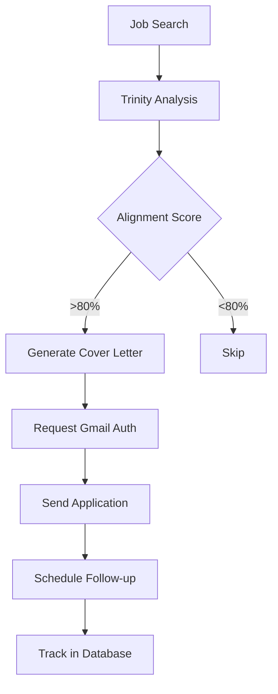
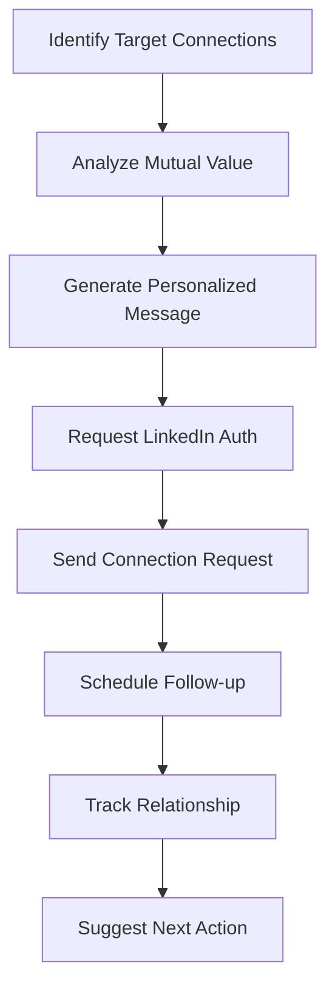
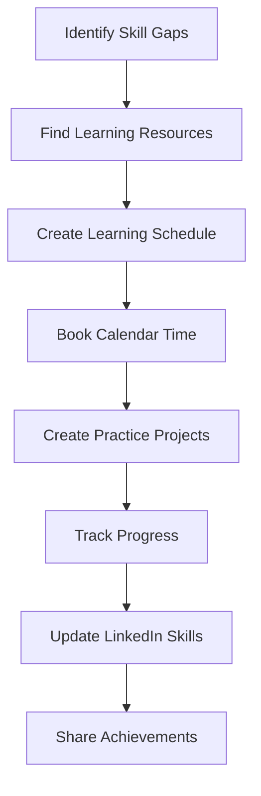
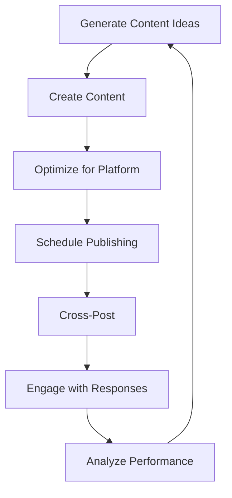
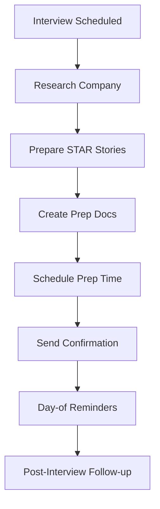

# Quest Core Arcade Workflows

*Last Updated: December 2024*

## Overview

This document details the AI-powered workflows that transform Quest Core from a career planning tool to an autonomous career development engine. Each workflow leverages Arcade.dev for authenticated actions on behalf of users.

## Core Workflows

### 1. Trinity-Aligned Job Hunt

**Purpose**: Automatically find and apply to jobs that match the user's Trinity



#### Implementation

```typescript
export class TrinityJobHuntWorkflow {
  private readonly ALIGNMENT_THRESHOLD = 0.8
  
  async findAndApplyToJobs(userId: string, userProfile: UserProfile) {
    // 1. Search for relevant jobs
    const jobs = await this.searchJobs(userProfile.skills, userProfile.preferences)
    
    // 2. Analyze Trinity alignment
    const alignedJobs = await Promise.all(
      jobs.map(async (job) => {
        const alignment = await this.calculateTrinityAlignment(job, userProfile.trinity)
        return { ...job, alignment }
      })
    )
    
    // 3. Filter high-alignment jobs
    const targetJobs = alignedJobs.filter(job => job.alignment > this.ALIGNMENT_THRESHOLD)
    
    // 4. Apply to each job
    for (const job of targetJobs) {
      await this.applyToJob(userId, job, userProfile)
    }
    
    return {
      searched: jobs.length,
      qualified: targetJobs.length,
      applied: targetJobs.length
    }
  }
  
  async calculateTrinityAlignment(job: JobPosting, trinity: Trinity): Promise<number> {
    const prompt = `
      Analyze alignment between this job and the user's Trinity:
      
      Job: ${job.title} at ${job.company}
      Description: ${job.description}
      
      User's Trinity:
      - Quest (Purpose): ${trinity.quest}
      - Service (Contribution): ${trinity.service}
      - Pledge (Commitment): ${trinity.pledge}
      
      Score from 0-1 based on:
      1. Mission alignment with Quest
      2. Role alignment with Service
      3. Values alignment with Pledge
      
      Return only the numerical score.
    `
    
    const response = await this.llm.invoke(prompt)
    return parseFloat(response.content)
  }
  
  async applyToJob(userId: string, job: JobPosting, profile: UserProfile) {
    // Generate Trinity-aligned cover letter
    const coverLetter = await this.generateCoverLetter(job, profile)
    
    // Get Gmail tool via Arcade
    const toolManager = await getArcadeToolManager(userId)
    const gmail = await toolManager.getTool('gmail')
    
    // Send application
    await gmail.sendEmail({
      to: job.applicationEmail,
      subject: `${profile.name} - ${job.title} Application`,
      body: coverLetter,
      attachments: [{
        filename: 'resume.pdf',
        content: profile.resumeBuffer
      }]
    })
    
    // Schedule follow-up
    await this.scheduleFollowUp(userId, job)
  }
}
```

### 2. Strategic Network Builder

**Purpose**: Build professional relationships aligned with career goals



#### Implementation

```typescript
export class StrategicNetworkingWorkflow {
  async buildTargetedNetwork(userId: string, profile: UserProfile) {
    // 1. Identify high-value connections
    const targets = await this.identifyNetworkingTargets(profile)
    
    // 2. For each target, create personalized outreach
    for (const target of targets) {
      await this.reachOutToConnection(userId, target, profile)
    }
  }
  
  async identifyNetworkingTargets(profile: UserProfile) {
    // Use LinkedIn API via Arcade to search
    const criteria = {
      industries: profile.targetIndustries,
      seniority: ['director', 'vp', 'cxo'],
      keywords: profile.skills,
      companies: profile.targetCompanies
    }
    
    const prospects = await this.searchLinkedIn(criteria)
    
    // Score each prospect
    return Promise.all(
      prospects.map(async (prospect) => {
        const score = await this.scoreNetworkingValue(prospect, profile)
        return { ...prospect, score }
      })
    ).then(scored => scored.filter(p => p.score > 0.7))
  }
  
  async reachOutToConnection(userId: string, target: LinkedInProfile, profile: UserProfile) {
    // Generate personalized message
    const message = await this.generateOutreachMessage(target, profile)
    
    // Get LinkedIn tool
    const toolManager = await getArcadeToolManager(userId)
    const linkedin = await toolManager.getTool('linkedin')
    
    // Send connection request
    await linkedin.sendConnectionRequest({
      profileId: target.id,
      message: message.connectionRequest
    })
    
    // Schedule follow-up message
    const calendar = await toolManager.getTool('google_calendar')
    await calendar.createEvent({
      title: `Follow up with ${target.name}`,
      description: message.followUpDraft,
      date: new Date(Date.now() + 7 * 24 * 60 * 60 * 1000) // 1 week
    })
    
    // Store in Neo4j
    await this.storeRelationship(profile.id, target.id, 'pending_connection')
  }
  
  async generateOutreachMessage(target: LinkedInProfile, profile: UserProfile) {
    const prompt = `
      Create a personalized LinkedIn connection request and follow-up message.
      
      Target: ${target.name}, ${target.title} at ${target.company}
      Recent activity: ${target.recentPosts.slice(0, 3).join(', ')}
      
      My Profile: ${profile.name}
      Trinity Quest: ${profile.trinity.quest}
      Seeking: ${profile.careerGoals}
      
      Connection Request (300 chars max):
      - Reference something specific from their profile
      - Show genuine interest in their work
      - Briefly mention mutual value
      
      Follow-up Message (if accepted):
      - Thank them for connecting
      - Share specific value proposition
      - Suggest concrete next step
    `
    
    const response = await this.llm.invoke(prompt)
    return this.parseOutreachMessages(response.content)
  }
}
```

### 3. Continuous Learning Engine

**Purpose**: Automate skill development based on career goals



#### Implementation

```typescript
export class ContinuousLearningWorkflow {
  async automateSkillDevelopment(userId: string, profile: UserProfile) {
    // 1. Analyze skill gaps
    const gaps = await this.analyzeSkillGaps(profile)
    
    // 2. Create learning plan
    const plan = await this.createLearningPlan(gaps, profile.learningStyle)
    
    // 3. Implement the plan
    await this.implementLearningPlan(userId, plan)
  }
  
  async analyzeSkillGaps(profile: UserProfile) {
    // Compare current skills with target role requirements
    const targetRoles = await this.getTargetRoleRequirements(profile.careerGoals)
    const currentSkills = profile.skills
    
    return targetRoles.requiredSkills.filter(
      skill => !currentSkills.includes(skill)
    )
  }
  
  async implementLearningPlan(userId: string, plan: LearningPlan) {
    const toolManager = await getArcadeToolManager(userId)
    
    // 1. Block calendar time
    const calendar = await toolManager.getTool('google_calendar')
    for (const session of plan.sessions) {
      await calendar.createEvent({
        title: `Learn: ${session.skill}`,
        description: session.resources.join('\n'),
        startTime: session.startTime,
        duration: session.duration,
        recurrence: 'WEEKLY'
      })
    }
    
    // 2. Create GitHub practice repos
    const github = await toolManager.getTool('github')
    for (const project of plan.projects) {
      await github.createRepository({
        name: project.name,
        description: `Learning ${project.skill} - Part of my Quest journey`,
        private: false,
        initializeWithReadme: true
      })
      
      // Add learning objectives to README
      await github.updateFile({
        repo: project.name,
        path: 'README.md',
        content: project.objectives,
        message: 'Add learning objectives'
      })
    }
    
    // 3. Set up progress tracking
    const notion = await toolManager.getTool('notion')
    await notion.createPage({
      parent: profile.notionWorkspaceId,
      title: `Learning Plan: ${plan.name}`,
      properties: {
        skills: plan.skills,
        deadline: plan.targetDate,
        progress: 0
      }
    })
  }
}
```

### 4. Professional Brand Amplifier

**Purpose**: Build and maintain professional presence across platforms



#### Implementation

```typescript
export class ProfessionalBrandWorkflow {
  async amplifyProfessionalBrand(userId: string, profile: UserProfile) {
    // 1. Generate Trinity-aligned content
    const content = await this.generateBrandContent(profile)
    
    // 2. Publish across platforms
    await this.publishContent(userId, content)
    
    // 3. Engage with community
    await this.engageWithAudience(userId, profile)
  }
  
  async generateBrandContent(profile: UserProfile) {
    const prompt = `
      Generate professional content ideas based on:
      
      Trinity:
      - Quest: ${profile.trinity.quest}
      - Service: ${profile.trinity.service}
      - Pledge: ${profile.trinity.pledge}
      
      Recent achievements: ${profile.recentAchievements}
      Target audience: ${profile.targetAudience}
      
      Create:
      1. LinkedIn article (800 words)
      2. Twitter thread (5-7 tweets)
      3. GitHub project showcase
      
      Focus on demonstrating expertise while staying authentic to Trinity.
    `
    
    return await this.llm.invoke(prompt)
  }
  
  async publishContent(userId: string, content: Content) {
    const toolManager = await getArcadeToolManager(userId)
    
    // LinkedIn article
    const linkedin = await toolManager.getTool('linkedin')
    await linkedin.publishArticle({
      title: content.linkedinArticle.title,
      content: content.linkedinArticle.body,
      tags: content.linkedinArticle.tags
    })
    
    // Twitter thread
    const twitter = await toolManager.getTool('twitter')
    for (const tweet of content.twitterThread) {
      await twitter.postTweet({
        text: tweet,
        replyToId: previousTweetId
      })
    }
    
    // GitHub showcase
    const github = await toolManager.getTool('github')
    await github.updateProfile({
      bio: content.githubBio,
      pinnedRepos: content.showcaseRepos
    })
  }
}
```

### 5. Interview Preparation Assistant

**Purpose**: Comprehensive interview preparation and scheduling



#### Implementation

```typescript
export class InterviewPrepWorkflow {
  async prepareForInterview(userId: string, interview: InterviewDetails) {
    // 1. Deep company research
    const research = await this.researchCompany(interview.company)
    
    // 2. Prepare Trinity-aligned stories
    const stories = await this.prepareSTARStories(interview, profile)
    
    // 3. Create and share prep materials
    await this.createPrepMaterials(userId, interview, research, stories)
    
    // 4. Schedule preparation
    await this.schedulePreparation(userId, interview)
  }
  
  async researchCompany(company: string) {
    // Use web search and analysis
    const data = await this.webSearch(`${company} culture values mission recent news`)
    
    return {
      mission: data.mission,
      values: data.values,
      recentNews: data.news,
      interviewProcess: data.interviewTips,
      questionsToAsk: this.generateSmartQuestions(data)
    }
  }
  
  async prepareSTARStories(interview: InterviewDetails, profile: UserProfile) {
    const prompt = `
      Prepare STAR stories for ${interview.role} at ${interview.company}.
      
      User's background: ${profile.experience}
      Trinity: ${profile.trinity}
      
      Create 5 STAR stories that:
      1. Demonstrate required skills
      2. Align with company values
      3. Showcase Trinity alignment
      4. Include quantifiable results
    `
    
    return await this.llm.invoke(prompt)
  }
  
  async schedulePreparation(userId: string, interview: InterviewDetails) {
    const toolManager = await getArcadeToolManager(userId)
    const calendar = await toolManager.getTool('google_calendar')
    
    // Block prep time
    await calendar.createEvent({
      title: `Interview Prep: ${interview.company}`,
      startTime: new Date(interview.date.getTime() - 24 * 60 * 60 * 1000),
      duration: 90,
      description: 'Review prep materials, practice answers'
    })
    
    // Day-of reminder
    await calendar.createEvent({
      title: `Interview Reminder: ${interview.company}`,
      startTime: new Date(interview.date.getTime() - 60 * 60 * 1000),
      duration: 30,
      reminder: 15
    })
  }
}
```

## Advanced Workflows

### 6. Career Pivot Orchestrator

**Purpose**: Manage complete career transitions

```typescript
export class CareerPivotWorkflow {
  async orchestratePivot(userId: string, fromRole: string, toRole: string) {
    // 1. Gap analysis
    const gaps = await this.analyzeTransitionGaps(fromRole, toRole)
    
    // 2. Create transition plan
    const plan = await this.createTransitionPlan(gaps)
    
    // 3. Execute plan components
    await this.executeTransitionPlan(userId, plan)
  }
}
```

### 7. Freelance Pipeline Manager

**Purpose**: Automate freelance business development

```typescript
export class FreelancePipelineWorkflow {
  async manageFreelancePipeline(userId: string, profile: FreelanceProfile) {
    // 1. Find opportunities
    const opportunities = await this.findFreelanceOpportunities(profile)
    
    // 2. Submit proposals
    await this.submitProposals(userId, opportunities)
    
    // 3. Manage client relationships
    await this.manageClientRelationships(userId)
  }
}
```

### 8. Conference Network Maximizer

**Purpose**: Maximize value from professional events

```typescript
export class ConferenceNetworkWorkflow {
  async maximizeConferenceValue(userId: string, conference: ConferenceDetails) {
    // 1. Pre-conference outreach
    await this.preConferenceOutreach(userId, conference)
    
    // 2. Schedule meetings
    await this.scheduleMeetings(userId, conference)
    
    // 3. Post-conference follow-up
    await this.postConferenceFollowUp(userId, conference)
  }
}
```

## Workflow Orchestration

### Master Career Agent

The Master Career Agent orchestrates all workflows based on user context:

```typescript
export class MasterCareerAgent {
  private workflows: Map<string, BaseWorkflow> = new Map([
    ['job_hunt', new TrinityJobHuntWorkflow()],
    ['networking', new StrategicNetworkingWorkflow()],
    ['learning', new ContinuousLearningWorkflow()],
    ['brand', new ProfessionalBrandWorkflow()],
    ['interview', new InterviewPrepWorkflow()]
  ])
  
  async processUserIntent(userId: string, message: string) {
    // 1. Understand intent
    const intent = await this.understandIntent(message)
    
    // 2. Check required authorizations
    const requiredAuth = await this.checkRequiredAuth(intent)
    
    // 3. Execute appropriate workflow
    const workflow = this.workflows.get(intent.type)
    return await workflow.execute(userId, intent.parameters)
  }
  
  async runDailyCareerTasks(userId: string) {
    const profile = await this.getUserProfile(userId)
    
    // Run appropriate workflows based on user stage
    if (profile.isJobSeeking) {
      await this.workflows.get('job_hunt').checkNewJobs(userId)
    }
    
    if (profile.hasUpcomingInterviews) {
      await this.workflows.get('interview').prepareForToday(userId)
    }
    
    // Always run networking and brand building
    await this.workflows.get('networking').dailyEngagement(userId)
    await this.workflows.get('brand').checkContentCalendar(userId)
  }
}
```

## Error Handling & Recovery

### Graceful Degradation

```typescript
export class WorkflowErrorHandler {
  async handleAuthFailure(userId: string, service: string) {
    // 1. Notify user
    await this.notifyUser(userId, `Please reauthorize ${service}`)
    
    // 2. Queue task for retry
    await this.queueForRetry(userId, service)
    
    // 3. Provide alternative actions
    return this.suggestAlternatives(service)
  }
  
  async handleRateLimit(service: string) {
    // Implement exponential backoff
    await this.waitWithBackoff(service)
  }
}
```

## Privacy & Control

### User Preferences

```typescript
interface WorkflowPreferences {
  autoApply: {
    enabled: boolean
    minAlignmentScore: number
    maxPerDay: number
    excludeCompanies: string[]
  }
  
  networking: {
    autoConnect: boolean
    messageStyle: 'formal' | 'casual' | 'friendly'
    targetSeniority: string[]
  }
  
  learning: {
    hoursPerWeek: number
    preferredTimes: string[]
    platforms: string[]
  }
}
```

### Activity Dashboard

Users can see all actions taken on their behalf:
- Applications sent
- Connections made
- Content published
- Skills tracked
- Time saved

## Success Metrics

### Workflow Performance

```typescript
interface WorkflowMetrics {
  jobApplications: {
    sent: number
    responses: number
    interviews: number
    offers: number
    averageAlignmentScore: number
  }
  
  networking: {
    connectionsM

: number
    acceptanceRate: number
    conversationsStarted: number
    meetingsScheduled: number
  }
  
  learning: {
    skillsAcquired: number
    projectsCompleted: number
    certificationsEarned: number
    hoursInvested: number
  }
}
```

## Future Workflows

### Coming Soon
1. **Salary Negotiation Assistant** - Research and negotiate offers
2. **Performance Review Prep** - Compile achievements and feedback
3. **Side Project Launcher** - Automate side business setup
4. **Mentor Matching** - Find and connect with mentors
5. **Speaking Opportunity Finder** - Identify and apply to speak

---

*These workflows transform Quest Core from a career planning tool to your personal career acceleration engine.*