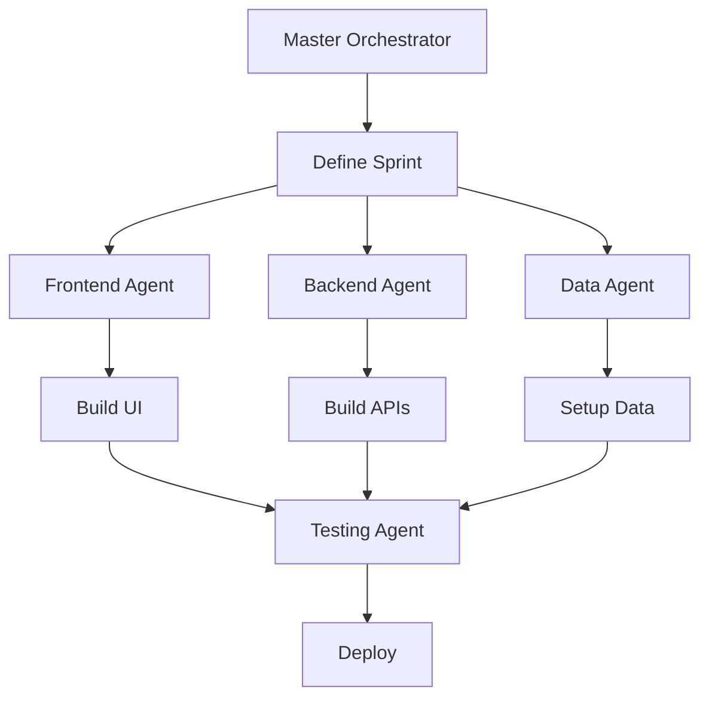

# V3 Claude.md - AI Assistant Context

*Last Updated: December 2024*
*Note: This file will be renamed to CLAUDE.md after V3 launch*

## 🎯 Project Overview

Quest V3 is a complete restart of the Quest platform, focusing on serving the startup ecosystem with Trinity-based matching. We're deleting all V2 code and starting fresh with a dramatically simplified architecture.

> "One platform, multiple perspectives - from finding your purpose to funding your vision"

## 🏗️ V3 Architecture Decisions

### Core Principles
1. **Sanity-First**: ALL data in Sanity CMS (investors, jobs, journalists, content)
2. **Minimal Code**: MCP reduces code by 80-95%
3. **Unified Platform**: One app serving founders, investors, professionals, journalists
4. **Voice-First**: Hume AI for natural conversations
5. **Action-Oriented**: Arcade.dev for real outcomes

### Technology Stack

```typescript
const v3Stack = {
  // Core
  framework: 'Next.js 15',
  language: 'TypeScript',
  styling: 'Tailwind CSS',
  
  // Data & Storage
  primaryDatabase: 'Sanity CMS',    // Everything stored here
  vectorSearch: 'PG Vector',        // Only for embeddings
  auth: 'Clerk',
  
  // AI & Voice
  llmGateway: 'OpenRouter',
  models: {
    master: 'GPT-4 Turbo',
    specialist: 'Claude-3 Sonnet',
    technical: 'Kimi K2'
  },
  voice: 'Hume AI EVI 3',
  
  // Integrations via MCP
  scraping: 'Apify MCP',
  content: 'Sanity MCP',
  extraction: 'Firecrawl MCP',
  
  // Actions
  userActions: 'Arcade.dev'
}
```

## 🎭 MBAD Hybrid Implementation

We're using a **hybrid MBAD approach** combining model-driven architecture with specialized AI agents:

### AI Agent Team

1. **Master Orchestrator** (Claude/You)
   - Overall architecture decisions
   - Sprint planning
   - Integration coordination
   - Quality control

2. **Frontend Specialist** (Claude with Next.js focus)
   - React components
   - Tailwind styling
   - Voice UI integration
   - Responsive design

3. **Backend Specialist** (Kimi K2)
   - API routes
   - Database operations
   - Integration logic
   - Performance optimization

4. **Data Specialist** (Claude with Sanity focus)
   - Schema design
   - Data ingestion
   - Review workflows
   - Vector sync

5. **Testing Specialist** (Kimi K2 Free)
   - Test generation
   - Edge case identification
   - Performance testing
   - Security validation

### Agent Workflow



## 📁 V3 Repository Structure

```
quest-v3/
├── app/                    # Next.js app directory
│   ├── (marketing)/       # Public pages
│   ├── (auth)/           # Auth flows
│   ├── (app)/            # Main application
│   └── api/              # API routes
├── components/            # React components
│   ├── ui/               # Base UI components
│   ├── trinity/          # Trinity-specific
│   └── shared/           # Shared across roles
├── lib/                   # Utilities
│   ├── sanity/           # Sanity client
│   ├── vector/           # PG Vector
│   └── mcp/              # MCP integrations
├── schemas/               # Sanity schemas
├── public/               # Static assets
└── docs/                 # Documentation
```

## 🚀 Development Guidelines

### Code Principles

1. **Minimal Code**: Use MCP whenever possible
2. **Type Safety**: Strict TypeScript
3. **Component Reuse**: Build once, use everywhere
4. **Voice-First**: Design for conversation
5. **Role Adaptation**: Components adapt based on user

### Naming Conventions

```typescript
// Components: PascalCase
export function TrinityDiscovery() {}

// Utilities: camelCase
export function matchInvestors() {}

// Types: PascalCase with suffix
interface InvestorProfile {}
type UserRole = 'founder' | 'investor'

// Files: kebab-case
trinity-discovery.tsx
investor-profile.ts
```

### MCP Usage

```typescript
// ❌ Don't write complex integrations
const client = new ApifyClient(...)
// 100+ lines of error handling

// ✅ Do use MCP
const data = await mcp.apify.scrape({
  actor: 'linkedin-scraper',
  url: profileUrl
})
```

## 🔄 Sprint Structure

### 6-Day MBAD Sprints

**Day 1: Planning**
- Master Orchestrator defines goals
- Agents receive assignments
- Architecture decisions

**Day 2-3: Parallel Development**
- Frontend Agent: UI components
- Backend Agent: APIs
- Data Agent: Schemas

**Day 4-5: Integration**
- Combine agent outputs
- Testing Agent validates
- Fix issues

**Day 6: Ship**
- Deploy to production
- Monitor performance
- Plan next sprint

## 📊 Key Features for V3

### 1. Trinity Discovery
- Voice-first with Hume AI
- Natural conversation flow
- Visual representation
- <10 minute completion

### 2. Matching Engine
- PG Vector semantic search
- Trinity alignment scoring
- Multi-factor ranking
- Real-time updates

### 3. Human Review
- Sanity Studio interface
- Review queues
- Bulk operations
- Quality metrics

### 4. User Actions
- Arcade.dev integration
- Email introductions
- Calendar scheduling
- Application sending

## 🎯 Current Status

**Phase**: Pre-launch development
**Sprint**: Planning Sprint 1
**Target Launch**: 2 weeks

### Completed
- ✅ V3 architecture defined
- ✅ Sanity-first approach
- ✅ MBAD methodology chosen
- ✅ Tech stack finalized

### In Progress
- 🔄 Setting up development environment
- 🔄 Creating Sanity schemas
- 🔄 Defining agent workflows

### Next Steps
- [ ] Initialize V3 repository
- [ ] Set up Sanity project
- [ ] Configure MCP integrations
- [ ] Build Trinity discovery

## 💡 Important Context

### Why V3?
- V2 became too complex
- Market opportunity in startups
- Unified platform > separate apps
- Sanity + MCP = minimal code

### Key Innovations
1. **Trinity Matching**: Nobody else does purpose-based matching
2. **Voice-First**: 10x faster than forms
3. **Unified Platform**: Network effects
4. **MCP Integration**: 80% less code

### Success Metrics
- Week 2: 100 users, 10 connections
- Month 1: 1K users, $10K MRR
- Month 3: 10K users, $50K MRR

## 🚨 Critical Reminders

1. **Delete V2 Code**: Start completely fresh
2. **Sanity for Everything**: No separate admin tools
3. **MCP First**: Only write custom code when necessary
4. **Ship Daily**: Something live every day
5. **Focus on Founders**: They're the primary persona

## 📚 V3 Documentation

### Core Documents
- `V3_PRODUCT_REQUIREMENTS.md` - Complete PRD
- `V3_RESTART_PLAN.md` - Technical strategy  
- `V3_SANITY_SCHEMA.md` - Data models
- `V3_MCP_INTEGRATION.md` - Minimal code approach
- `V3_UNIFIED_PLATFORM.md` - Single platform strategy
- `V3_MBAD_IMPLEMENTATION.md` - Development methodology
- `V3_MBAD_CHECKLIST.md` - Sprint checklists

### Migration Plan
After V3 launch, all V3_ prefixed files will be renamed to replace V2 versions.

## 🤝 Working with Agents

### Agent Communication
- Clear task boundaries
- Shared context via this file
- Daily sync points
- Async collaboration

### Quality Standards
- Code review by Master
- Testing Agent validation
- Performance benchmarks
- User feedback loops

## 🎯 Mission Statement

**Build the simplest possible platform that connects the startup ecosystem through authentic purpose, enabling real actions and outcomes.**

---

*"Delete everything. Start fresh. Ship in 2 weeks. Change how startups connect forever."*