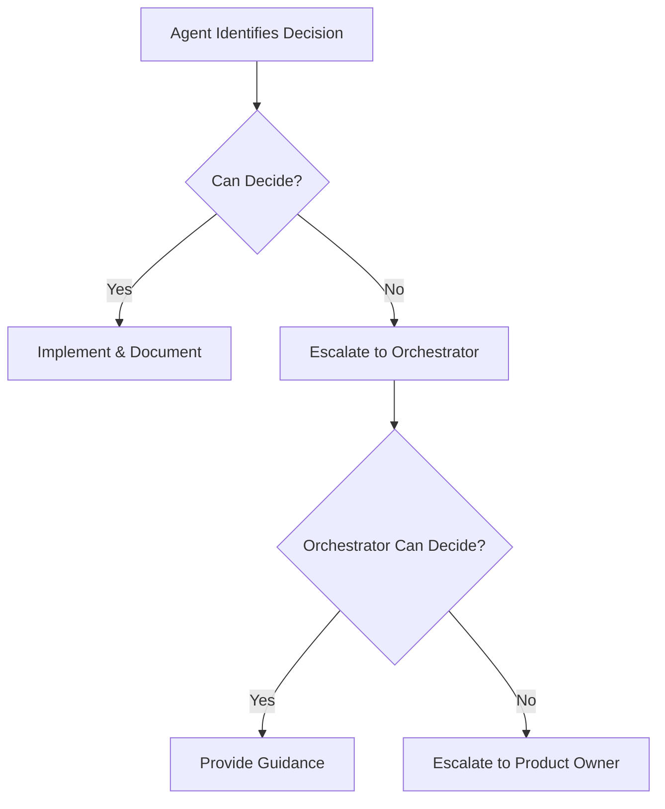

# V3 MBAD Implementation Guide

*Last Updated: December 2024*

## Overview

Quest V3 uses a hybrid MBAD (Model-Based Agile Development) approach, combining the efficiency of specialized AI agents with the oversight of human product ownership. This document defines our implementation strategy.

## MBAD Principles for Quest V3

### 1. Model-Driven Architecture
- AI agents generate code from high-level specifications
- Natural language requirements → working code
- Conversations replace documentation

### 2. Specialized Agent Team
- Each agent has deep expertise in one area
- Agents collaborate through structured handoffs
- No single point of failure

### 3. Continuous Deployment
- Ship every feature immediately
- No feature branches
- Production is the only environment

### 4. Human-in-the-Loop
- Product Owner sets vision and priorities
- Agents execute with autonomy
- Human reviews critical decisions

## Agent Team Structure

### 1. AI Orchestrator (Claude)
**Role**: Project coordinator and primary interface

**Responsibilities**:
- Understand product requirements
- Coordinate specialized agents
- Ensure architectural consistency
- Communicate with Product Owner

**Key Decisions**:
- Feature prioritization
- Architecture choices
- Technology selection
- Sprint planning

### 2. Frontend Agent
**Specialization**: UI/UX implementation

**Expertise**:
- Next.js 15 App Router
- React Server Components
- Tailwind CSS styling
- Responsive design
- Voice UI integration

**Example Tasks**:
```typescript
// Frontend Agent creates Trinity discovery UI
export function TrinityDiscovery() {
  const [stage, setStage] = useState<'quest' | 'service' | 'pledge'>('quest')
  const { startRecording, isRecording } = useVoice()
  
  return (
    <div className="trinity-discovery">
      <VoiceInterface 
        stage={stage}
        onComplete={(response) => processStage(response, stage)}
      />
      <ProgressIndicator current={stage} />
    </div>
  )
}
```

### 3. Backend Agent
**Specialization**: API and server logic

**Expertise**:
- Next.js API routes
- Database operations
- Authentication flows
- Third-party integrations
- Performance optimization

**Example Tasks**:
```typescript
// Backend Agent creates matching API
export async function POST(request: Request) {
  const { userId, targetType } = await request.json()
  
  // Get user Trinity
  const user = await sanityClient.fetch(
    `*[_type == "user" && clerkId == $userId][0]`,
    { userId }
  )
  
  // Find matches using PG Vector
  const matches = await pgVector.search({
    embedding: user.trinity.embedding,
    type: targetType,
    limit: 10
  })
  
  return Response.json({ matches })
}
```

### 4. Data Agent
**Specialization**: Sanity CMS and data architecture

**Expertise**:
- Sanity schema design
- GROQ queries
- Data modeling
- PG Vector embeddings
- Webhook configuration

**Example Tasks**:
```javascript
// Data Agent creates Sanity schemas
export const investorSchema = {
  name: 'investor',
  type: 'document',
  fields: [
    {
      name: 'name',
      type: 'string',
      validation: Rule => Rule.required()
    },
    // ... complete schema
  ]
}
```

### 5. Integration Agent
**Specialization**: External services and MCP

**Expertise**:
- MCP configuration
- API integrations
- Webhook handling
- Data synchronization
- Error handling

**Example Tasks**:
```typescript
// Integration Agent sets up Apify MCP
const investorIngestion = {
  async scrapeLinkedIn(url: string) {
    const data = await mcp.apify.scrape({
      actor: 'linkedin-scraper',
      url
    })
    
    await mcp.sanity.create_document({
      type: 'investor',
      data: { ...data, verified: false }
    })
  }
}
```

### 6. Quality Agent
**Specialization**: Testing and deployment

**Expertise**:
- Automated testing
- Performance monitoring
- Error tracking
- Deployment automation
- Security scanning

**Example Tasks**:
```typescript
// Quality Agent creates tests
describe('Trinity Matching', () => {
  it('should match investors by alignment', async () => {
    const founder = { trinity: { quest: 'democratize AI' } }
    const matches = await matchInvestors(founder)
    
    expect(matches[0].alignmentScore).toBeGreaterThan(0.75)
  })
})
```

## Sprint Structure

### 6-Day Sprint Cycle

**Day 1: Planning & Architecture**
- Product Owner defines sprint goals
- Orchestrator breaks down into tasks
- Agents claim their specializations
- Architecture decisions made

**Day 2-3: Core Development**
- Agents work in parallel
- Frequent integration commits
- Continuous deployment

**Day 4-5: Integration & Polish**
- Cross-agent collaboration
- End-to-end testing
- UI/UX refinement

**Day 6: Ship & Learn**
- Final deployment
- User feedback collection
- Retrospective planning

## Communication Protocol

### Agent Handoffs
```typescript
// Frontend → Backend handoff
interface HandoffRequest {
  from: 'frontend-agent'
  to: 'backend-agent'
  task: 'Create API endpoint for Trinity submission'
  context: {
    endpoint: '/api/trinity/submit'
    payload: TrinitySubmission
    expectedResponse: TrinityResponse
  }
}
```

### Decision Escalation


## Development Workflow

### 1. Feature Request
```markdown
Product Owner: "We need voice-based Trinity discovery"
```

### 2. Orchestrator Planning
```markdown
Claude: Breaking down into tasks:
1. Voice UI component (Frontend Agent)
2. Hume AI integration (Integration Agent)
3. Trinity processing API (Backend Agent)
4. Data storage schema (Data Agent)
5. End-to-end tests (Quality Agent)
```

### 3. Parallel Execution
Each agent works on their specialized task simultaneously

### 4. Integration
```bash
# Continuous integration as agents complete tasks
git commit -m "feat: Add voice recording UI"
git commit -m "feat: Integrate Hume AI for voice processing"
git commit -m "feat: Create Trinity submission API"
```

### 5. Deployment
```bash
# Automatic deployment on commit
vercel deploy --prod
```

## Code Generation Patterns

### Frontend Pattern
```typescript
// Agent-generated component template
export function ${ComponentName}({
  ${props}
}: ${ComponentName}Props) {
  // State management
  const [state, setState] = useState(initialState)
  
  // Effects
  useEffect(() => {
    // Side effects
  }, [dependencies])
  
  // Render
  return (
    <div className="${kebab-case-name}">
      {/* Component content */}
    </div>
  )
}
```

### API Pattern
```typescript
// Agent-generated API template
export async function ${METHOD}(request: Request) {
  try {
    // Validate input
    const data = await request.json()
    const validated = ${schema}.parse(data)
    
    // Business logic
    const result = await ${businessLogic}(validated)
    
    // Return response
    return Response.json({ success: true, data: result })
  } catch (error) {
    return Response.json({ success: false, error: error.message }, { status: 400 })
  }
}
```

## Quality Standards

### Code Quality Metrics
- TypeScript strict mode
- 90%+ type coverage
- No any types
- Consistent formatting

### Performance Targets
- Page load: <2s
- API response: <200ms
- Voice response: <500ms
- 99.9% uptime

### Security Requirements
- Input validation on all endpoints
- Authenticated routes protected
- Sensitive data encrypted
- Regular dependency updates

## Monitoring & Feedback

### Real-time Monitoring
```typescript
// Automatic instrumentation
export function withMonitoring(handler: Handler) {
  return async (request: Request) => {
    const start = Date.now()
    
    try {
      const response = await handler(request)
      
      // Log success
      logger.info({
        path: request.url,
        duration: Date.now() - start,
        status: response.status
      })
      
      return response
    } catch (error) {
      // Log error
      logger.error({
        path: request.url,
        error: error.message,
        stack: error.stack
      })
      
      throw error
    }
  }
}
```

### Continuous Learning
- Agent performance tracked
- Common patterns identified
- Knowledge base updated
- Process improvements implemented

## Success Metrics

### Sprint Velocity
- Features shipped per sprint
- Code quality score
- Bug rate
- User satisfaction

### Agent Performance
- Task completion time
- Code quality
- Integration success
- Rework rate

### Business Impact
- User growth
- Feature adoption
- Revenue impact
- Customer feedback

## Scaling Considerations

### When to Add Agents
- Specialized domain emerges
- Consistent bottlenecks
- New technology adoption
- Quality concerns

### When to Consolidate
- Overlapping responsibilities
- Low task volume
- Simplified architecture
- Maintenance overhead

## Risk Mitigation

### Technical Risks
- **Agent Failure**: Other agents can cover
- **Integration Issues**: Orchestrator coordinates
- **Quality Concerns**: Quality Agent validates

### Process Risks
- **Miscommunication**: Clear handoff protocol
- **Scope Creep**: Product Owner gatekeeps
- **Technical Debt**: Regular refactoring sprints

## Enhancement: Context Engineering Integration

### PRP Framework (Product Requirement Prompts)
Based on Cole Medin's context engineering approach, we're enhancing MBAD with:

**1. Comprehensive Context Templates**
```yaml
MBAD-PRP Structure:
  - Feature Definition: Clear articulation of business goals
  - Technical Context: Complete codebase patterns and dependencies
  - Implementation Blueprint: Step-by-step development with validation gates
  - Error Handling: Predefined recovery strategies
```

**2. Validation Gates**
- Built-in testing checkpoints throughout development
- Self-correcting systems for common issues
- Automated quality verification before deployment

**3. Agent-Specific PRPs**
Each specialized agent receives tailored PRPs:
- Frontend Agent: Component patterns, design system rules
- Backend Agent: API specifications, performance requirements
- Data Agent: Schema definitions, query patterns
- Integration Agent: External service documentation

### Serena MCP Integration

**Semantic Code Understanding**
Integrating Serena MCP server provides:
- Symbol-level code comprehension (vs text search)
- Multi-language LSP support
- Efficient navigation of large codebases
- Free alternative to Cursor/Windsurf

**MBAD Benefits**:
1. **Architecture Discovery**: Analyze existing patterns for MBAD compliance
2. **Model Validation**: Verify implementation matches specifications
3. **Sanity Navigation**: Enhanced understanding of schema relationships
4. **Refactoring Support**: Safe code transformations with semantic awareness

**Implementation**:
```json
{
  "mcpServers": {
    "serena": {
      "command": "uvx",
      "args": ["--from", "git+https://github.com/oraios/serena", "serena-mcp-server"]
    }
  }
}
```

## Enhanced Workflow

### Context-First Development
1. **Define**: Create comprehensive PRP for feature
2. **Analyze**: Use Serena to understand existing code
3. **Generate**: Agents create code from PRP + semantic understanding
4. **Validate**: Automated gates verify implementation
5. **Deploy**: Ship with confidence

### Example Enhanced Sprint
```typescript
// Day 1: Enhanced Planning
const featurePRP = {
  goal: "Voice-based Trinity discovery",
  context: await serena.analyzeCodebase(),
  blueprint: detailedImplementationSteps,
  validation: {
    gates: ["unit tests", "integration tests", "user acceptance"],
    recovery: errorHandlingStrategies
  }
}

// Agents receive comprehensive context
orchestrator.distributeWork(featurePRP, {
  frontend: frontendSpecificPRP,
  backend: backendSpecificPRP,
  data: dataSpecificPRP
})
```

## Conclusion

The enhanced MBAD hybrid approach with Context Engineering and Serena allows Quest V3 to:
- Ship 10x faster with comprehensive context
- Maintain higher quality through semantic understanding
- Scale efficiently with specialized, context-aware agents
- Validate implementations against specifications automatically
- Adapt quickly with built-in error recovery

By combining specialized AI agents, human oversight, deep context engineering, and semantic code understanding, we achieve unprecedented development velocity without sacrificing quality.

---

*"Model the future, build it today - with intelligence and context."*