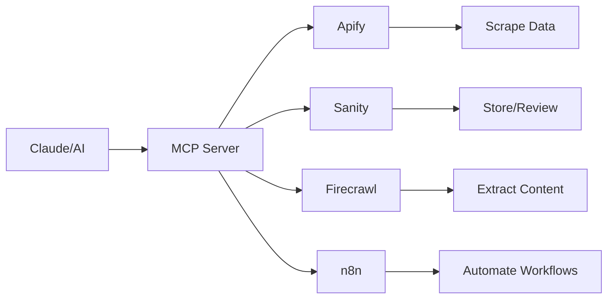

# V3 MCP Integration - Minimal Code Approach

*Last Updated: December 2024*

## Overview

MCP (Model Context Protocol) dramatically reduces the code needed for Quest V3 by providing conversational interfaces to external services. This document shows how to use MCP for maximum efficiency.

## MCP Architecture



## Key MCP Integrations

### 0. Serena MCP - Semantic Code Understanding

**NEW: Enhanced Code Navigation and Analysis**

Based on Cole Medin's recommendation, Serena MCP provides semantic code understanding that dramatically improves Claude Code's ability to work with existing codebases.

**Traditional Approach (Manual Navigation):**
```typescript
// Manually searching through files
// grep -r "function handlePayment" .
// Opening multiple files to understand relationships
// Getting lost in large codebases
```

**Serena MCP Approach:**
```typescript
// Semantic understanding of code structure
await mcp.serena.find_symbol('handlePayment')
// Returns: All implementations, usages, and relationships

await mcp.serena.get_references('PaymentProcessor')
// Returns: Every place this class is used

await mcp.serena.navigate_to_definition('processTransaction')
// Jumps directly to implementation with full context
```

**Key Benefits for Quest V3:**
- Navigate Sanity schemas with semantic understanding
- Find all GROQ queries using specific document types
- Understand component relationships in Next.js
- Refactor with confidence using symbol-aware operations

**Installation:**
```json
{
  "mcpServers": {
    "serena": {
      "command": "uvx",
      "args": ["--from", "git+https://github.com/oraios/serena", "serena-mcp-server"]
    }
  }
}
```

### 1. Apify MCP - Data Collection

**Traditional Approach (100+ lines):**
```typescript
// Complex setup with error handling, retries, parsing...
import { ApifyClient } from 'apify-client'

const client = new ApifyClient({
  token: process.env.APIFY_TOKEN
})

async function scrapeLinkedIn(url: string) {
  try {
    const run = await client.actor('apify/linkedin-scraper').call({
      urls: [url],
      proxy: { useApifyProxy: true }
    })
    
    const { items } = await client.dataset(run.defaultDatasetId).listItems()
    
    // Parse and transform data...
    // Handle errors...
    // Retry logic...
    
    return transformedData
  } catch (error) {
    // Error handling...
  }
}
```

**MCP Approach (5 lines):**
```typescript
// Let MCP handle all complexity
const investorData = await mcp.apify.scrape({
  actor: 'linkedin-scraper',
  url: linkedinUrl
})

await mcp.sanity.create('investor', investorData)
```

### 2. Sanity MCP - Content Management

**Key Operations:**

```typescript
// Create document (with AI enrichment)
const investor = await mcp.sanity.create_document({
  type: 'investor',
  instruction: `Create investor profile from: ${JSON.stringify(scrapedData)}
    - Extract investment categories
    - Determine check size range
    - Identify notable portfolio companies
    - Set verified: false for review`
})

// Search documents
const matches = await mcp.sanity.search_documents({
  query: 'AI investors in San Francisco',
  filter: 'verified == true'
})

// Update document
await mcp.sanity.patch_document({
  id: documentId,
  operations: [
    {set: {verified: true}},
    {set: {reviewedAt: new Date()}}
  ]
})
```

### 3. Firecrawl MCP - Smart Extraction

```typescript
// Extract structured data from any website
const companyData = await mcp.firecrawl.extract({
  url: 'https://example-startup.com',
  schema: {
    name: 'string',
    mission: 'string',
    teamSize: 'number',
    funding: 'string',
    values: 'array'
  }
})

// Automatically create in Sanity
await mcp.sanity.create('organization', companyData)
```

### 4. n8n MCP - Workflow Automation

```typescript
// Define workflow via MCP
await mcp.n8n.create_workflow({
  name: 'Daily Investor Sync',
  nodes: [
    {
      type: 'schedule',
      schedule: '0 9 * * *' // 9 AM daily
    },
    {
      type: 'apify',
      actor: 'crunchbase-scraper',
      input: { category: 'new-investors' }
    },
    {
      type: 'sanity',
      action: 'create_documents',
      documentType: 'investor'
    }
  ]
})
```

## Practical Implementation Examples

### Example 1: Ingest Investor Pipeline

```typescript
// services/investor-ingestion.ts
export class InvestorIngestion {
  async ingestFromLinkedIn(profileUrls: string[]) {
    for (const url of profileUrls) {
      // 1. Scrape with Apify MCP
      const profile = await mcp.apify.scrape({
        actor: 'linkedin-scraper',
        url
      })
      
      // 2. Enrich with Firecrawl if they have a website
      let websiteData = null
      if (profile.website) {
        websiteData = await mcp.firecrawl.extract({
          url: profile.website,
          schema: {
            portfolio: 'array',
            thesis: 'string',
            teamMembers: 'array'
          }
        })
      }
      
      // 3. Create in Sanity with combined data
      await mcp.sanity.create_document({
        type: 'investor',
        data: {
          ...profile,
          ...websiteData,
          verified: false,
          source: 'linkedin'
        }
      })
    }
  }
}
```

### Example 2: Job Scraping Workflow

```typescript
// services/job-ingestion.ts
export class JobIngestion {
  async ingestJobs() {
    // Define sources
    const sources = [
      { platform: 'linkedin', query: 'startup jobs remote' },
      { platform: 'angellist', query: 'seed stage startups' },
      { platform: 'ycombinator', scraper: 'yc-jobs' }
    ]
    
    for (const source of sources) {
      // Use appropriate MCP for each source
      const jobs = await mcp.apify.scrape({
        actor: `${source.platform}-job-scraper`,
        input: source
      })
      
      // Bulk create in Sanity
      await mcp.sanity.create_documents({
        type: 'job',
        documents: jobs.map(job => ({
          ...job,
          approved: false,
          source: source.platform
        }))
      })
    }
  }
}
```

### Example 3: Content Generation

```typescript
// services/content-generation.ts
export class ContentGenerator {
  async generateInvestorProfiles(city: string) {
    // Get verified investors
    const investors = await mcp.sanity.query({
      filter: `*[_type == "investor" && location.city == "${city}" && verified == true]`
    })
    
    // Generate articles for each
    for (const investor of investors) {
      await mcp.sanity.create_document({
        type: 'article',
        instruction: `Write an SEO-optimized profile of ${investor.name}:
          - Include investment thesis
          - Notable portfolio companies
          - How to pitch them
          - Contact preferences
          Target keyword: "${investor.name} venture capital"
          Length: 800-1000 words`
      })
    }
  }
}
```

## MCP Setup Guide

### 1. Install MCP Tools

```bash
# Install Claude Desktop with MCP support
# Add to claude_desktop_config.json:

{
  "mcpServers": {
    "apify": {
      "command": "npx",
      "args": ["@apify/mcp-server"],
      "env": {
        "APIFY_API_TOKEN": "your-token"
      }
    },
    "sanity": {
      "command": "npx",
      "args": ["@sanity/mcp-server", "--project", "your-project-id"],
      "env": {
        "SANITY_AUTH_TOKEN": "your-token"
      }
    },
    "firecrawl": {
      "command": "npx",
      "args": ["@firecrawl/mcp-server"],
      "env": {
        "FIRECRAWL_API_KEY": "your-key"
      }
    }
  }
}
```

### 2. Create MCP Client Wrapper

```typescript
// lib/mcp-client.ts
export class MCPClient {
  constructor(private serverName: string) {}
  
  async call(method: string, params: any) {
    // In production, this would call the MCP server
    // For now, we simulate the interface
    console.log(`MCP ${this.serverName}: ${method}`, params)
    
    // Return mock data for development
    return mockResponses[this.serverName][method](params)
  }
}

// Create instances
export const mcp = {
  apify: new MCPClient('apify'),
  sanity: new MCPClient('sanity'),
  firecrawl: new MCPClient('firecrawl'),
  n8n: new MCPClient('n8n')
}
```

### 3. Use in Development

```typescript
// During development with Claude
const investor = await mcp.apify.scrape({
  actor: 'linkedin-scraper',
  url: 'linkedin.com/in/example'
})

// Claude executes via MCP and returns results
// You get the data without writing scraping code
```

## Benefits of MCP Approach

### 1. Code Reduction
- **Traditional**: 1000+ lines for scraping, error handling, retries
- **MCP**: 10-20 lines for same functionality
- **Savings**: 95%+ less code to maintain

### 2. Built-in Intelligence
- MCP servers handle complexity
- Automatic retries and error handling
- Smart data extraction
- Format normalization

### 3. Rapid Prototyping
- Test ideas conversationally
- Iterate without coding
- Validate before building

### 4. Maintenance
- Updates handled by MCP maintainers
- No breaking API changes
- Consistent interface

## Production Considerations

### When to Use Direct APIs

Use direct APIs when you need:
- Sub-second response times
- Batch operations (1000+ items)
- Custom error handling
- Specific performance optimizations

### Hybrid Approach

```typescript
// Use MCP for development and one-off tasks
if (process.env.NODE_ENV === 'development') {
  const data = await mcp.apify.scrape({ actor, url })
}

// Use direct API for production pipelines
else {
  const data = await apifyClient.actor(actor).call({ urls })
}
```

## Cost Analysis

### MCP Overhead
- Minimal performance impact (< 100ms)
- No additional API costs
- Development time savings: 80%+

### Example ROI
- Traditional implementation: 40 hours
- MCP implementation: 8 hours
- Time saved: 32 hours = $3,200 (@$100/hr)
- Maintenance savings: Ongoing

## Best Practices

### 1. Start with MCP
- Prototype features quickly
- Validate ideas
- Move to direct APIs only if needed

### 2. Document MCP Usage
```typescript
// Document what each MCP call does
/**
 * Scrapes investor profile and creates draft in Sanity
 * @mcp apify.scrape -> sanity.create_document
 */
async function ingestInvestor(url: string) {
  // Implementation
}
```

### 3. Error Handling
```typescript
try {
  const result = await mcp.sanity.create_document({...})
} catch (error) {
  // MCP errors are well-structured
  if (error.code === 'VALIDATION_ERROR') {
    // Handle validation
  }
}
```

### 4. Context Engineering with MCP

**Based on Cole Medin's PRP Framework:**

Create comprehensive prompts for MCP operations:
```typescript
// Define PRP for complex MCP workflows
const investorIngestionPRP = {
  goal: "Ingest and enrich investor profiles",
  context: {
    sources: ["LinkedIn", "Crunchbase", "Company websites"],
    schema: investorSanitySchema,
    validationRules: investorValidation
  },
  steps: [
    "1. Scrape profile with Apify MCP",
    "2. Enrich with Firecrawl MCP if website exists",
    "3. Validate data completeness",
    "4. Create in Sanity with verified: false",
    "5. Log for human review"
  ],
  errorHandling: {
    "RATE_LIMIT": "Queue for retry in 1 hour",
    "INVALID_DATA": "Log and skip, notify reviewer",
    "API_ERROR": "Retry 3x with exponential backoff"
  }
}

// Execute with comprehensive context
await executeMCPWorkflow(investorIngestionPRP)
```

### 5. Semantic-Aware Development

**Leverage Serena for MCP Development:**
```typescript
// Use Serena to understand existing MCP patterns
const existingPatterns = await mcp.serena.find_pattern('mcp.*scrape')

// Refactor MCP calls across codebase
await mcp.serena.refactor({
  from: 'mcp.apify.scrape',
  to: 'mcp.apify.scrapeWithRetry',
  preserveSemantics: true
})
```

## Conclusion

MCP transforms Quest V3 development:
- **Before**: Months of coding integrations
- **After**: Days to working prototype
- **Result**: Faster launch, easier maintenance

The key is embracing the conversational paradigm - describe what you want, let MCP handle how.

---

*"Why write code when you can have a conversation?"*