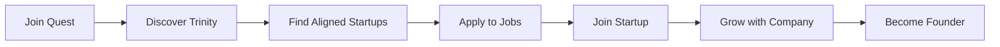

# V3 Unified Platform Strategy

*Last Updated: December 2024*

## Vision

**One Platform, Multiple Perspectives**

Quest V3 serves the entire startup ecosystem through a single, unified platform that adapts based on who you are:
- **Founders** see funding opportunities and talent
- **Investors** see qualified deal flow
- **Professionals** see purpose-driven jobs
- **Journalists** see authentic stories

## Why Unified?

### The Problem with Separate Apps
1. **Development overhead**: 3x the code to maintain
2. **User confusion**: Which app do I use?
3. **Data silos**: No network effects
4. **Higher costs**: Multiple deployments, databases
5. **Slower iteration**: Changes needed in multiple places

### The Power of Unity
1. **Network effects**: Each user strengthens the whole platform
2. **Single sign-on**: One account for everything
3. **Cross-pollination**: Founders become investors, professionals become founders
4. **Shared infrastructure**: 70% code reuse
5. **Rapid development**: Ship once, benefit all

## Architecture

### Single Next.js Application

```typescript
// app/layout.tsx - Unified layout with role detection
export default function RootLayout({ children }) {
  const { user } = useAuth()
  const userRole = user?.metadata?.primaryRole || 'visitor'
  
  return (
    <html>
      <body>
        <Navigation role={userRole} />
        <main className={`quest-${userRole}`}>
          {children}
        </main>
      </body>
    </html>
  )
}
```

### Dynamic Home Experience

```typescript
// app/page.tsx - Adaptive homepage
export default function HomePage() {
  const { user } = useAuth()
  
  if (!user) return <LandingPage />
  
  switch (user.metadata.primaryRole) {
    case 'founder':
      return <FounderDashboard />
    case 'investor':
      return <InvestorDashboard />
    case 'professional':
      return <ProfessionalDashboard />
    case 'journalist':
      return <JournalistDashboard />
    default:
      return <RoleSelectionFlow />
  }
}
```

### Unified Data Model

```typescript
// Everyone has Trinity
interface UnifiedUser {
  id: string
  email: string
  name: string
  
  // Core identity
  trinity: {
    quest: string    // What drives you
    service: string  // How you serve
    pledge: string   // What you commit to
  }
  
  // Role-specific data
  primaryRole: 'founder' | 'investor' | 'professional' | 'journalist'
  secondaryRoles: string[]
  
  // Unified activity
  connections: Connection[]
  introductions: Introduction[]
  messages: Message[]
}
```

## User Journeys

### The Founder Path


### The Professional Path



### The Ecosystem Effect

1. **Professional** joins Quest, finds purpose
2. Joins **Startup** through Trinity matching
3. Startup grows, professional becomes **Co-founder**
4. Raises funding through Quest **Investors**
5. Hires team through Quest **Jobs**
6. Gets coverage through Quest **PR**
7. Exits and becomes **Angel Investor**
8. Cycle continues...

## Technical Implementation

### Route Structure

```
app/
├── (marketing)/
│   ├── page.tsx              // Public landing
│   ├── about/page.tsx
│   └── pricing/page.tsx
├── (auth)/
│   ├── sign-in/page.tsx
│   └── onboarding/page.tsx   // Trinity discovery
├── (app)/
│   ├── dashboard/page.tsx    // Adaptive by role
│   ├── discover/
│   │   ├── investors/page.tsx
│   │   ├── jobs/page.tsx
│   │   └── stories/page.tsx
│   ├── profile/
│   │   ├── page.tsx          // Unified profile
│   │   └── edit/page.tsx
│   └── settings/page.tsx
└── api/
    ├── matching/route.ts     // Trinity matching
    ├── introductions/route.ts
    └── webhooks/route.ts
```

### Component Architecture

```typescript
// Shared components adapt based on context
export function DiscoveryCard({ item, userRole }) {
  // Same component, different rendering
  switch (item.type) {
    case 'investor':
      return <InvestorCard investor={item} showActions={userRole === 'founder'} />
    case 'job':
      return <JobCard job={item} showApply={userRole === 'professional'} />
    case 'story':
      return <StoryCard story={item} showPitch={userRole === 'founder'} />
  }
}
```

### Unified Search

```typescript
// One search, multiple perspectives
export function UnifiedSearch() {
  const { user } = useAuth()
  const [query, setQuery] = useState('')
  
  const results = useSearch(query, {
    types: getSearchTypesForRole(user.metadata.primaryRole),
    filters: getTrinityFilters(user.trinity)
  })
  
  return (
    <SearchInterface>
      <SearchBar value={query} onChange={setQuery} />
      <SearchResults results={results} userContext={user} />
    </SearchInterface>
  )
}
```

## Progressive Complexity

### Phase 1: MVP (Week 1-2)
- Single role selection on sign-up
- Basic Trinity discovery
- Founder ↔ Investor matching only
- Simple email introductions

### Phase 2: Multi-Role (Month 1)
- Users can have multiple roles
- Add job posting/searching
- LinkedIn-style profiles
- In-app messaging

### Phase 3: Full Ecosystem (Month 3)
- Journalist integration
- Automated workflows (Arcade.dev)
- Relationship graph (Neo4j)
- Advanced analytics

## Benefits for Each User Type

### Founders Get
- Investor discovery by Trinity alignment
- Talent that shares their mission
- Media coverage for their story
- Network of fellow founders

### Investors Get
- Pre-qualified deal flow
- Founders with clear vision (Trinity)
- Portfolio talent pipeline
- Co-investment opportunities

### Professionals Get
- Purpose-driven opportunities
- Direct founder access
- Career growth in startups
- Equity opportunities

### Journalists Get
- Authentic founder stories
- Verified startups
- Easy expert access
- Story leads

## Revenue Model Aligned with Unity

### Universal Free Tier
- Trinity discovery
- Basic search
- 5 introductions/month
- Public profile

### Role-Based Premium
- **Founder Pro** ($99/mo): Unlimited intros, priority matching
- **Investor Pro** ($299/mo): Advanced filters, deal flow API
- **Professional Pro** ($29/mo): Apply priority, salary insights
- **Journalist Pro** ($49/mo): Media kit access, PR tools

### Platform Success Fees
- 0.5% on successful funding
- $500 on successful hire
- $100 on media placement

## Marketing Strategy

### One Brand, Multiple Messages

**Landing Pages:**
- quest.com → General value prop
- quest.com/founders → Founder-specific
- quest.com/investors → Investor-specific
- quest.com/talent → Professional-specific

**SEO Domains (redirect to main):**
- placement.quest → quest.com/investors
- join.quest → quest.com/talent
- pr.quest → quest.com/media

### Content Strategy
- Unified blog with category filters
- Success stories from all perspectives
- Trinity discovery as viral hook
- Network growth visualization

## Technical Advantages

### Shared Infrastructure
```typescript
// One auth system
const auth = useAuth()

// One database
const db = prisma

// One search engine
const search = pgVector

// One UI library
const ui = '@quest/components'

// One deployment
const deploy = 'vercel'
```

### Simplified DevOps
- Single repository
- One CI/CD pipeline
- Unified monitoring
- Shared feature flags

### Faster Development
- Build once, available everywhere
- Shared components
- Unified testing
- Single documentation

## Migration Path

### From Current State
1. **Week 1**: Strip down to core (delete 90%)
2. **Week 2**: Build unified auth + Trinity
3. **Week 3**: Add role selection + matching
4. **Week 4**: Launch with 100 beta users

### No Legacy Baggage
- Start fresh with V3
- No migration needed
- Clean architecture
- Modern stack only

## Success Metrics

### Platform Health
- Daily active users across all roles
- Cross-role interactions (founder → investor)
- Trinity completion rate
- Introduction success rate

### Network Effects
- Users with multiple roles
- Referral rate
- Time to first value
- Retention by role

### Business Metrics
- MRR by user type
- Success fee revenue
- CAC by channel
- LTV by role

## Why This Wins

### For Users
1. **Simple**: One place for everything
2. **Powerful**: Network effects
3. **Flexible**: Grow into new roles
4. **Valuable**: Real connections

### For Business
1. **Efficient**: 70% less code
2. **Scalable**: One platform to scale
3. **Defensible**: Network moat
4. **Profitable**: Multiple revenue streams

## The Quest Ecosystem Vision

```
One Platform
One Account
One Trinity
Infinite Possibilities
```

From finding your purpose to funding your vision to sharing your story - all in one place.

---

*"Why build three platforms when one serves everyone better?"*